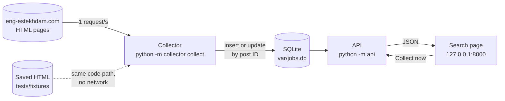
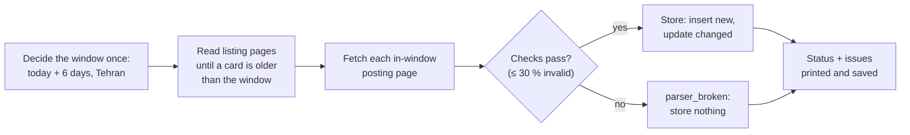
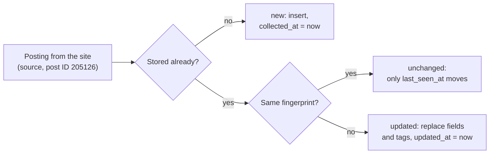

# job-posting-collector

Collects the job postings of the last 7 Tehran days from [eng-estekhdam.com](https://eng-estekhdam.com/)
by reading its HTML, stores them in SQLite with UTC timestamps, and serves them through an HTTP
API and one search page. Every run reports whether the whole window was covered and lists each
page or record that failed.



**Quick start** (after [Setup](#setup)):

```bash
python -m collector collect     # about 76 polite requests, a little over a minute
python -m api                   # then open http://127.0.0.1:8000/
```

| Document | What is in it |
|---|---|
| [`docs/DESIGN.md`](docs/DESIGN.md) | Components, one run step by step, data model, a posting traced end to end, adding a site, broken-parser handling, trade-offs |
| [`docs/LIVE_RUN.md`](docs/LIVE_RUN.md) | The recorded live run and its independent check |
| [`docs/TIME_LOG.md`](docs/TIME_LOG.md), [`docs/AI_NOTES.md`](docs/AI_NOTES.md) | Time per step, from the session timestamps; every decision about AI output |
| [`PLAN.md`](PLAN.md), [`docs/WORKFLOW.md`](docs/WORKFLOW.md) | The plan agreed before coding, with the requirement checklist; how each step was built and reviewed (issue → PR → Codex review → merge) |

## Setup

Requirements: **Python 3.12** (3.12.13 locally on macOS; GitHub Actions runs the tests on Ubuntu).
SQLite comes with Python. Dependencies are pinned in `pyproject.toml`: httpx 0.28.1,
beautifulsoup4 4.15.0, lxml 6.1.3, jdatetime 6.1.0, tzdata 2026.5, FastAPI 0.142.2, uvicorn 0.54.0;
for tests pytest 9.1.1 and pytest-playwright 0.9.0 (Playwright 1.63, Chromium).

```bash
python3.12 -m venv .venv
source .venv/bin/activate
pip install -e ".[dev]"
python -m playwright install chromium   # once, for the one browser test
```

## Run the tests

```bash
pytest
```

The tests never touch the live website: they use saved pages in `tests/fixtures/`. GitHub Actions
runs them on every pull request.

## Initialize the database

```bash
python -m collector init-db             # creates var/jobs.db (safe to run again)
python -m collector --db other.db init-db
```

The collect command and the API also create the tables if they are missing.

## Collect postings

```bash
python -m collector collect
```



Requests go one at a time, at least 1 second apart, with a named User-Agent. Timeouts, connection
errors, 429 and 5xx are retried at most 3 times (waits 2 s and 4 s). Redirects and other 4xx are
reported and never followed. The last lines printed, and the exit code, say how the run went:

| Status | Exit | Meaning |
|---|---|---|
| `success` / `success_empty` / `success_with_warnings` | 0 | The whole window was read (`empty`: the site had no postings in it) |
| `partial` | 1 | Window fully read, but some postings were rejected (see issues) |
| `incomplete` | 2 | The window was not fully read (a listing page failed or ended early, or the 40-page cap was hit) |
| `blocked` | 3 | The site answered with a firewall or challenge page; the run stopped asking |
| `parser_broken` | 4 | Listing page 1 unrecognized, or more than 30 % of records invalid: **nothing stored** |
| `failed` | 5 | A bug (traceback in the run's issues), or the process stopped (no sign of life for 3 minutes) |
| not started | 6 | Another run is in progress |

Each problem is an issue with a code (list in `PLAN.md` §6), stored with the run. When a run has
a problem, every page it read is saved to `var/snapshots/<run id>/` with a `manifest.json`, so the
run can be replayed offline. `--now` sets the moment the pages were saved; it decides the window
and the postings' `collected_at`, while the run itself is recorded with the real time. `--now` is
refused without `--from-dir`: a live run always uses the real clock.

```bash
python -m collector collect --from-dir var/snapshots/12/ --now 2026-10-08T06:00:00Z
```

The committed site snapshot replays the same way (68 postings for 2026-10-01..07 Tehran; running
it again reports 68 unchanged):

```bash
python -m collector --db var/replay.db collect --from-dir tests/fixtures/eng_estekhdam/snapshot --now 2026-10-07T17:00:00Z
```

## Start the API and the page

```bash
python -m api                           # options: --db, --host, --port
```

Open `http://127.0.0.1:8000/`. Interactive API docs are at `/docs` (Swagger) and `/redoc`.

| Part of the page | What it does |
|---|---|
| **Last run** + **Collect now** | Status badge, window and counts. The button starts a run; while it runs, a progress line updates every 2 s; at the end the status and issue codes show and the data reloads |
| **Postings per day, by industry** | One stacked bar per Tehran day (Jalali and Gregorian labels), split by the site's field tags; hover for the breakdown, "Show as a table" for the numbers, click a day to filter by it |
| **Search** | Date from/to (Jalali shown beside each), keyword, tag (with counts). Filters are copied into the page URL, so a search can be bookmarked |
| **Results** | Title, Jalali and Gregorian date (Tehran), tags, snippet; click for the full text, collected/updated times (UTC) and a link to the original. With no filters, every stored posting shows (100 per page) |
| **Run history** | The last 10 runs with counts and health numbers; click one for its issues grouped by code |


| Desktop: list and an open posting | Phone |
|---|---|
|  |  |

**Safety.** Scraped text is only inserted as text (`textContent`), never as HTML; links are made
only for `http`/`https` addresses. Every response sends `Content-Security-Policy: default-src 'self'`
(the docs pages get a looser policy because they load Swagger from a CDN). The server listens on
`127.0.0.1` and answers only to the host names `127.0.0.1` and `localhost`. There is no login (the
brief leaves authentication out), and **Collect now** starts a process, so do not expose the
server publicly. Details: [`docs/DESIGN.md`](docs/DESIGN.md#untrusted-html-and-the-page).

## API

| Route | Returns |
|---|---|
| `GET /api/postings` | Search. `date_from`, `date_to` (`YYYY-MM-DD` Tehran days, both inclusive), `q` (keyword), `tag` (slug or Persian label), `page`, `page_size` (default 20, max 100). Newest first: `{items, total, page, page_size}` |
| `GET /api/postings/{id}` | One posting with its full text |
| `GET /api/tags` | Every tag with its kind, Persian label and count |
| `GET /api/stats` | Postings per Tehran day for the current 7-day window, by industry group, and the top tags |
| `GET /api/runs?limit=20` | Run history: status, counts, health numbers, error and warning counts |
| `GET /api/runs/{id}` | One run with its issues grouped by code (counters update while it runs) |
| `POST /api/runs` | **Collect now**: needs header `X-Collect-Trigger: 1` (else 403); 409 if a run is active; else 202 with `run_id`, and the collect command starts as a separate process (log in `var/logs/run-<id>.log`) |

Filters combine with AND. All timestamps are UTC with `Z`; each posting also has
`published_date_tehran` and `published_date_jalali`. A bad date, or `date_from` after `date_to`,
is a 422 with a message. Within one day, results are ordered by the site's post ID, highest first
(the site shows no time of day; its IDs follow creation order).

### Example queries

Each filter alone:

```bash
curl "http://127.0.0.1:8000/api/postings?date_from=2026-10-08&date_to=2026-10-08"   # one Tehran day
curl "http://127.0.0.1:8000/api/postings?tag=civil"                                 # tag by slug
curl "http://127.0.0.1:8000/api/postings?q=autocad"                                 # keyword, any case
```

Combined (AND) and more:

```bash
curl "http://127.0.0.1:8000/api/postings?q=AutoCAD&tag=civil&date_from=2026-10-02&date_to=2026-10-08"
curl "http://127.0.0.1:8000/api/postings?tag=civil&date_from=2026-10-03&date_to=2026-10-05"
curl -G "http://127.0.0.1:8000/api/postings" --data-urlencode "q=مهندس عمران"        # Persian phrase
curl -G "http://127.0.0.1:8000/api/postings" --data-urlencode "tag=تهران" -d page=2 -d page_size=10
curl -X POST -H "X-Collect-Trigger: 1" http://127.0.0.1:8000/api/runs               # start a run
curl "http://127.0.0.1:8000/api/runs?limit=1"                                       # follow it
```

Their outputs on live data are in [`docs/LIVE_RUN.md`](docs/LIVE_RUN.md#api-on-the-live-data).

## How data is handled

### Dates and time zones

```text
card date   ۱۴ مهر ۱۴۰۵  →  14 Mehr 1405  →  2026-10-06 (Tehran day)  →  00:00 Tehran  →  stored 2026-10-05T20:30:00Z
```

- The source shows only a Persian (Jalali) date, with no time of day. `jdatetime` converts it.
- **Storage convention:** the publication timestamp is **00:00 in Tehran** on that day, stored in
  UTC. It is not an observed publication time; the source page does not show one.
- Every stored and returned timestamp is UTC, ISO 8601 with `Z`.
- Tehran's offset comes from the `Asia/Tehran` time-zone database (`zoneinfo` + pinned `tzdata`),
  never a fixed `+03:30`, so past dates with daylight saving time stay correct.
- **Collection window:** "today" is decided in Tehran once, at the start of a run. The window is
  today and the previous six Tehran days, as a UTC range that includes the first midnight and
  excludes the midnight after the last day. A run at 01:00 Tehran on 8 Oct (still 7 Oct in UTC)
  collects 2–8 Oct.
- **Date filters** use the same rule: `date_from=2026-10-04&date_to=2026-10-06` means
  `2026-10-03T20:30:00Z <= published_at < 2026-10-06T20:30:00Z`.
- An unreadable date (unknown month, impossible day such as 31 Mehr) is an error, never guessed.

### Search normalization and case handling

Stored text and queries go through the same `normalize()`: Latin letters are case-folded
(`AutoCAD` = `autocad`); Arabic `ي`/`ك` become Persian `ی`/`ک` (the source mixes both); Persian and
Arabic-Indic digits become `0–9`; the half-space (zero-width non-joiner) and repeated whitespace
become one space. The keyword is one phrase matched as a substring of title + body.

### Tag mapping

Tags come only from the posting's own labels on the source. Nothing is generated, and the
site-wide menu is never copied onto a posting.

| Source label | Stored tag | Where it is read |
|---|---|---|
| Province category, e.g. `category-tehran` → "تهران" | `kind=province`, `slug=tehran`, `label=تهران` | article class on the card; `rel="category tag"` link on the posting page (an ad can name two provinces) |
| Field tag, e.g. `tag-civil` → "عمران" | `kind=field`, `slug=civil`, `label=عمران` | article class on the card; `.entry-tags a[rel=tag]` on the posting page |

The posting page's labels are stored; if they differ from the card's, a `TAGS_MISMATCH` warning
is recorded. Field tags seen on the site (labels as the site writes them):

| slug | label | slug | label |
|---|---|---|---|
| `civil` | عمران | `structure` | سازه |
| `memari` | معماری | `marine` | سازه دریایی |
| `surveying` | نقشه برداري | `hydraulic` | سازه هیدرولیکی |
| `road` | راه ترابری | `geotechnic` | خاک پی |
| `rail` | راه آهن | `earthquake` | زلزله |
| `water` | آب فاضلاب | `environment` | محیط زیست |
| `transportation` | حمل نقل | `management` | مدیریت ساخت |

The chart's industry groups are built from these field tags; the rule is in
[`docs/DESIGN.md`](docs/DESIGN.md#industry-groups-for-the-chart).

### Identity of a posting and how changes are handled



- **Identity:** `(source, source_post_id)`, the site's own WordPress post ID, enforced by a
  `UNIQUE` constraint. Not the URL or title: the URL slug is built from the title and changes
  when the title is edited.
- **Fingerprint:** a SHA-256 of everything stored from the source (URL, title, body, date, tags,
  members-only flag). `collected_at` is the first time a posting was stored and never changes.
- **No data loss:** an empty new title, body, URL or tag label never overwrites stored text; the
  stored value is kept and an `EMPTY_FIELD_KEPT` warning is recorded. Old postings are never deleted.
- `members_only_omitted = 1` marks postings whose contact section was members-only on the source
  and therefore not collected.

## Live collection evidence

[`docs/LIVE_RUN.md`](docs/LIVE_RUN.md). On 2026-10-08 a fresh clone collected the window
2026-10-02 .. 2026-10-08 Tehran (`2026-10-01T20:30:00Z` .. `2026-10-08T20:30:00Z`): status
`success`, **69 postings**, 0 rejected, no issues, in 1 min 17 s. It made 76 page requests: 7 listing
pages (10 ads each; the 70th card was already older than the window) and 69 posting pages, one per
ad, because only the posting page has the full text. A separate script that re-read every page
found all 69, nothing missing or extra, every field matching.

## Optional extras: value and cost

The brief asks only for the core. These were added on top, most of them at my request during
planning and review (times are from the Claude Code session; Tehran time). Each can be removed
without touching the core.

| Extra | Why (who asked) | Value | Cost |
|---|---|---|---|
| **Collect now** button | I asked for it, 7 Oct 19:51, so collecting needs no terminal | One click; runs the same command as the terminal | An endpoint that starts a process, so it needs guards: localhost only, trigger header, Host check, one-run lock |
| Run monitor, run history, issue codes | I asked for monitoring visuals and clearer error states, 7 Oct 19:12 | An incomplete or broken run is visible on the page, with the exact pages and codes | Two read-only routes and one page panel |
| Dead-run detection by heartbeat | Needed by Collect now; I questioned the first 30-minute guess, 8 Oct 16:37 | A crashed run stops blocking Collect now after 3 minutes | One column, one update per request |
| Per-day chart, split by industry | I asked for visuals, 7 Oct 19:12; the industry split was my idea, 8 Oct evening | Volume per day and field at a glance; click a day to filter | `/api/stats`, a 23-line grouping file, chart code |
| Swagger and ReDoc at `/docs` | I asked to keep them, 8 Oct 16:14 | Try every endpoint in a browser | A looser CSP on those two pages only |
| Snapshot replay (`--from-dir`, `--now`) | Claude's proposal in the plan, for the repair flow | Reproduce a problem run offline; the tests use the same path | A 15-line replay fetcher and a guard that refuses `--now` on live runs |
| Search copied into the page URL | Claude's proposal in the plan | A search can be bookmarked or shared | A few lines of page code |
| Persian font, phone layout | I asked, 8 Oct 21:56 | Readable Persian; usable on a phone | One self-hosted font file (SIL OFL), CSS |

## Time spent, limitations and unfinished work

About **8 h 10 min** for steps 0–8, measured from the timestamps of the Claude Code sessions for
this repository (7 Oct 17:58–22:16, 8 Oct 13:31–17:02 and 21:56–22:15, Tehran time), plus a
self-review on 8 Oct from 22:25 (step 9). Per step in [`docs/TIME_LOG.md`](docs/TIME_LOG.md).
An earlier version of this README said 7 h 30 min from memory; it left out the 8 Oct evening.

Known limitations:

- One source; runs are started by hand (no scheduler, as the brief allows).
- No login, so the server must stay on `127.0.0.1`.
- Within one day, order follows the site's post IDs, because the site shows no times.
- Members-only contact details are never collected.
- If an ad is deleted from the site **during** a run, the ads after it move up one place, and one
  ad can slip past the listing pages already read. It is not reported. The next run collects it
  unless it has left the window by then. A fix is designed but not built
  ([`docs/DESIGN.md`](docs/DESIGN.md#trade-offs-limitations-and-what-was-left-out)).

Designed but not built: a health drift alert, a layout fingerprint, a per-source on/off switch,
and the listing re-check above ([`docs/DESIGN.md`](docs/DESIGN.md#a-broken-parser-prevent-detect-contain-isolate-repair)).

## AI use

Claude Code wrote the plan, code, tests and docs with me, step by step; Codex reviewed every pull
request as a second reviewer. Every AI output was checked against the live site, a test or a
measurement before it was kept. Three examples (full log: [`docs/AI_NOTES.md`](docs/AI_NOTES.md)):

1. **Changed: "an empty listing page means there are no more postings."** Checked on the live
   site: `/page/99999/` answers HTTP 200 with zero ads, so an empty page proves nothing. Now an
   empty page before the window ends is `LISTING_EMPTY_EARLY` and the run is `incomplete`, never
   a quiet success; a test covers it.
2. **Changed: read the posting text from `article.typology-post`.** A live posting page holds six
   such articles (the ad plus five related ads), so the body would have mixed ads. Now only the
   main `typology-single-post` article is read, its post ID must equal the card's, and a test with
   a related ad placed first proves it.
3. **Rejected after questioning: a fixed 30-minute limit to declare a run dead.** The number was a
   guess. Replaced by a heartbeat after every request and a 3-minute limit derived from the
   longest healthy silence (one request with all retries, about 97 s); verified by killing a live
   run, which was marked `failed` after 3 minutes and no longer blocked Collect now.
