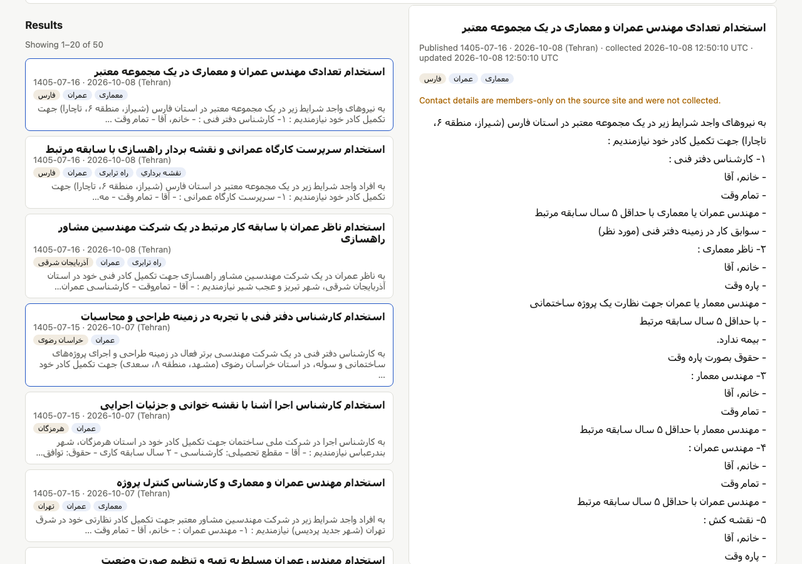

# job-posting-collector

Collects recent job postings from [eng-estekhdam.com](https://eng-estekhdam.com/) into SQLite,
with an HTTP API and a search page.

> Work in progress. Sections marked *(step N)* are filled in by that build step
> (issues #1–#8). The design and the requirement checklist are in [`PLAN.md`](PLAN.md); the
> way each step is built and reviewed is in [`docs/WORKFLOW.md`](docs/WORKFLOW.md).

## Requirements

- Python 3.12
- Dependencies pinned in `pyproject.toml`

## Setup

```bash
python3.12 -m venv .venv
source .venv/bin/activate
pip install -e ".[dev]"
```

## Run the tests

```bash
pytest
```

The one browser test (`tests/test_page_xss.py`) needs Chromium for Playwright, once:

```bash
python -m playwright install chromium
```

Tests never touch the live website; they use saved pages in `tests/fixtures/`.
GitHub Actions runs them on every pull request.

## Initialize the database

```bash
python -m collector init-db            # creates var/jobs.db (safe to run again)
python -m collector --db other.db init-db
```

The collect command and the API also create the tables if they are missing.

## Collect postings

```bash
python -m collector collect
```

One run collects today and the previous six days in Tehran time. It reads listing pages until it
meets a card older than the window, then fetches each in-window posting page, checks everything,
and only then writes to the database. Requests go one at a time, at least 1 second apart, with a
named User-Agent; timeouts, connection errors, 429 and 5xx are retried at most 3 times (waits 2 s
and 4 s); redirects and other 4xx are reported, never followed.

The last lines it prints, and the exit code, tell you how the run went:

| Status | Exit | Meaning |
|---|---|---|
| `success` / `success_empty` / `success_with_warnings` | 0 | The whole window was read (empty = the site had no postings in it) |
| `partial` | 1 | Window fully read, but some postings were rejected (see issues) |
| `incomplete` | 2 | The window was not fully read (a listing page failed, ended early, or the 40-page cap was hit) |
| `blocked` | 3 | The site answered with a firewall/challenge page; the run stopped asking |
| `parser_broken` | 4 | Listing page 1 unrecognized, or more than 30 % of records invalid: **nothing stored** |
| `failed` | 5 | A bug; the traceback is in the run's issues |
| not started | 6 | Another run is in progress (a run that shows no sign of life for 3 minutes is marked `failed` and no longer blocks) |

Each problem is an issue with a code (`PLAN.md` §6), stored with the run. When a run has a
problem, every page it read is saved to `var/snapshots/<run id>/` with a `manifest.json`, so the
whole run can be replayed offline (use the run's start time as `--now`):

```bash
python -m collector collect --from-dir var/snapshots/12/ --now 2026-10-08T06:00:00Z
```

Replaying the committed site snapshot needs the moment it was taken, so the window matches:

```bash
python -m collector --db var/replay.db collect --from-dir tests/fixtures/eng_estekhdam/snapshot --now 2026-10-07T17:00:00Z
```

That run reports 68 postings for 9–15 Mehr 1405 (2026-10-01..07 Tehran); running it again reports
68 unchanged. `--now` is refused without `--from-dir`: a live run always uses the real clock.

## Start the API and the page

```bash
python -m api
```

Open `http://127.0.0.1:8000/`. The page shows:

- **Last run** with its status badge, window and counts, and a **Collect now** button. While a
  run is going, the button is disabled and a progress line updates every 2 seconds (pages read,
  errors, warnings); when it ends, the final status and issue codes are shown and the data reloads.
- **Postings per day** for the 7-day window, each day labelled in Jalali and Gregorian; click a
  day to filter by it.
- **Search**: date from/to (the Jalali date appears beside each), keyword, tag (with counts),
  Search and Reset. The filters are copied into the page URL, so a search can be bookmarked or shared.
- **Results** ("Showing 1–20 of 68"), each with title, Jalali and Gregorian date (Tehran), tags
  and a snippet; click one for the full text, collected/updated times (UTC) and a link to the original.
- **Run history**: the last 10 runs with counts and health numbers; click one for its issues
  grouped by code, with the URLs involved.

Scraped text is only ever inserted as text (`textContent`), never as HTML, and links are only
made for `http`/`https` addresses. `tests/test_page_xss.py` loads a deliberately malicious
posting in a real browser and checks that the attack shows as plain characters and never runs.



The server listens on `http://127.0.0.1:8000` only. There is no login (the brief leaves authentication
out), and **Collect now** starts a process, so do not expose it publicly (`--host 0.0.0.0`).
Options: `--db`, `--host`, `--port`. Interactive API docs are at `http://127.0.0.1:8000/docs`
(Swagger, with "Try it out") and `/redoc`; the schema is at `/openapi.json`.

Every response carries `Content-Security-Policy: default-src 'self'` (the browser may load
nothing from anywhere else, and no inline script may run). The docs pages (`/docs`, `/redoc`) are
the exception: they load FastAPI's Swagger/ReDoc code from `cdn.jsdelivr.net` and run inline
scripts, so they get a looser policy. They show only our own API schema, never scraped HTML.

| Route | What it returns |
|---|---|
| `GET /api/postings` | Search: `date_from`, `date_to` (`YYYY-MM-DD` Tehran days, both inclusive), `q` (keyword), `tag` (slug or Persian label), `page`, `page_size` (default 20, max 100). Newest first, `{items, total, page, page_size}` |
| `GET /api/postings/{id}` | One posting with its full text |
| `GET /api/tags` | Every tag with its kind, Persian label and count |
| `GET /api/stats` | Postings per Tehran day for the current 7-day window (with Jalali dates) and the top tags |
| `GET /api/runs?limit=20` | Run history: status, counts, health numbers, error and warning counts |
| `GET /api/runs/{id}` | One run with its issues grouped by code (counters update while it runs) |
| `POST /api/runs` | **Collect now**: needs header `X-Collect-Trigger: 1` (else 403); 409 if a run is active; otherwise 202 with `run_id` and the collect command starts as a separate process, logging to `var/logs/run-<id>.log` |

Filters combine with AND. All timestamps are UTC with `Z`; each posting also has
`published_date_tehran` and `published_date_jalali`. A bad date, or `date_from` after `date_to`,
is a 422 with a message.

## Example API queries

```bash
# Civil-engineering postings from 3 to 5 October (Tehran days)
curl "http://127.0.0.1:8000/api/postings?tag=civil&date_from=2026-10-03&date_to=2026-10-05"
```

```bash
# Keyword phrase in Persian, any spelling variant (ي/ی, ۵/5, upper/lower case)
curl -G "http://127.0.0.1:8000/api/postings" --data-urlencode "q=مهندس عمران"
```

```bash
# Tag by its Persian label, second page of 10
curl -G "http://127.0.0.1:8000/api/postings" --data-urlencode "tag=تهران" -d page=2 -d page_size=10
```

```bash
# Start a collection from the API, then follow it
curl -X POST -H "X-Collect-Trigger: 1" http://127.0.0.1:8000/api/runs
```

```bash
curl http://127.0.0.1:8000/api/runs?limit=1
```

## How data is handled

### Dates and time zones

- The source shows Persian (Jalali) dates such as `۱۴ مهر ۱۴۰۵`, with no time of day.
  They are converted to Gregorian dates (`jdatetime`): 14 Mehr 1405 = 2026-10-06.
- **Storage convention:** a posting's publication timestamp is **00:00 in Tehran** on its date,
  stored in UTC: `2026-10-05T20:30:00Z`. This is not an observed publication time; the source
  page does not show one.
- All stored and returned timestamps are UTC, ISO 8601 with `Z`.
- Tehran's offset comes from the `Asia/Tehran` time zone database (`zoneinfo` + pinned `tzdata`),
  never a fixed `+03:30`, so past dates with daylight saving time stay correct.
- **Collection window:** "today" is decided in Tehran once, at the start of a run; the window is
  today and the previous six Tehran calendar days, converted to a UTC range that includes the
  first midnight and excludes the midnight after the last day. A run at 01:00 Tehran on 8 Oct
  (still 7 Oct in UTC) collects 2–8 Oct.
- **Date filters** use the same rule: `date_from=2026-10-04&date_to=2026-10-06` means
  `2026-10-03T20:30:00Z <= published_at < 2026-10-06T20:30:00Z`.
- An unreadable date (unknown month, impossible day such as 31 Mehr) is an error, never guessed.

### Search normalization and case handling

Stored text and queries pass through the same `normalize()`: Latin letters are case-folded
(`AutoCAD` = `autocad`); Arabic `ي`/`ك` become Persian `ی`/`ک` (the source mixes both); Persian
and Arabic-Indic digits become `0–9`; the zero-width non-joiner (half-space) and repeated
whitespace become one space.

### Tag mapping

Tags come only from the posting's own labels on the source; nothing is generated, and the
site-wide menu is never copied onto a posting.

| Source label | Stored tag | Where it is read |
|---|---|---|
| Province category, e.g. `category-tehran` → "تهران" | `kind=province`, `slug=tehran`, `label=تهران` | article class on the card; `rel="category tag"` link on the posting page (an ad can name two provinces) |
| Field tag, e.g. `tag-civil` → "عمران" | `kind=field`, `slug=civil`, `label=عمران` | article class on the card; `.entry-tags a[rel=tag]` on the posting page |

The posting page's labels are stored; if they differ from the card's, a `TAGS_MISMATCH` warning
is recorded. Field tags seen on the site (labels as the site writes them):

| slug | label | slug | label |
|---|---|---|---|
| `civil` | عمران | `structure` | سازه |
| `memari` | معماری | `marine` | سازه دریایی |
| `surveying` | نقشه برداري | `hydraulic` | سازه هیدرولیکی |
| `road` | راه ترابری | `geotechnic` | خاک پی |
| `rail` | راه آهن | `earthquake` | زلزله |
| `water` | آب فاضلاب | `environment` | محیط زیست |
| `transportation` | حمل نقل | `management` | مدیریت ساخت |

### Identity of a posting and how changes are handled

- **Identity:** `(source, source_post_id)`, the source's own WordPress post ID (e.g. `205126`),
  enforced by a `UNIQUE` constraint. Not the URL or title: the URL slug is built from the title
  and changes when the title is edited.
- **Re-collecting** the same posting never adds a row. A SHA-256 fingerprint of everything stored
  from the source (URL, title, body, date, tags, members-only flag) decides the result:
  - same fingerprint → `unchanged`; only `last_seen_at` moves;
  - different fingerprint → `updated`: fields, tags and search text replaced, `updated_at` moves.
- `collected_at` is the first time the posting was stored and never changes.
- **No data loss:** a new empty title, body, URL or tag label never overwrites stored text; the stored value
  is kept and an `EMPTY_FIELD_KEPT` warning is recorded.
- Old postings are never deleted.
- `members_only_omitted = 1` marks postings whose contact section was members-only on the
  source and therefore not collected.

## Design *(step 8)*

## Live collection evidence *(step 8)*

## Time spent, limitations and unfinished work *(step 8)*

See [`docs/TIME_LOG.md`](docs/TIME_LOG.md).

## AI use *(step 8)*

See [`docs/AI_NOTES.md`](docs/AI_NOTES.md).
