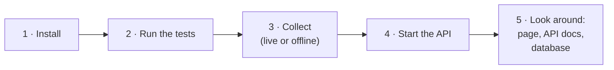
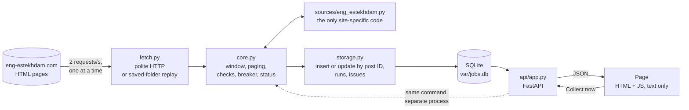
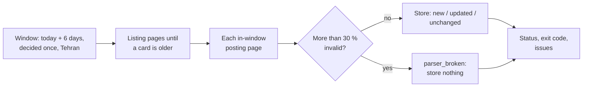
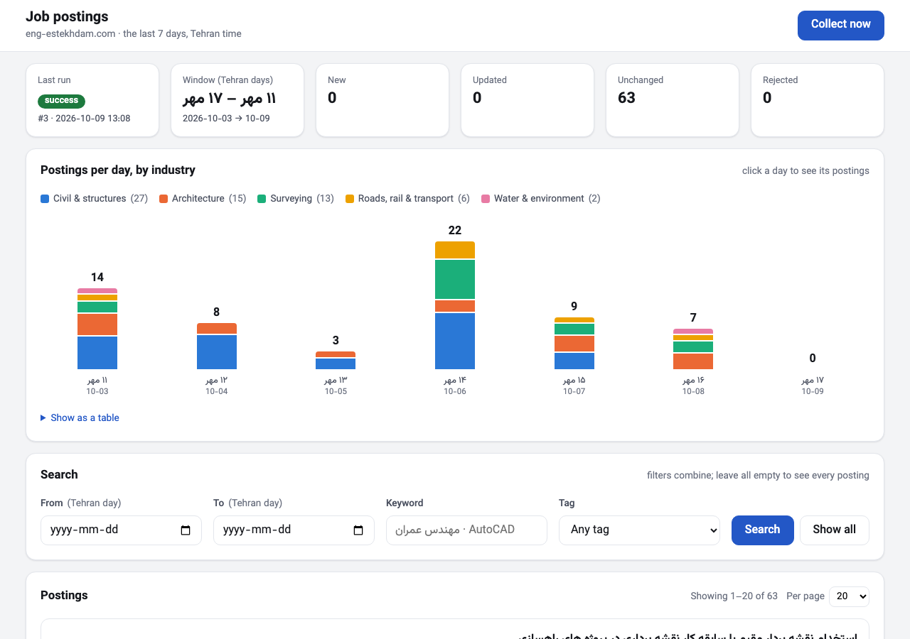
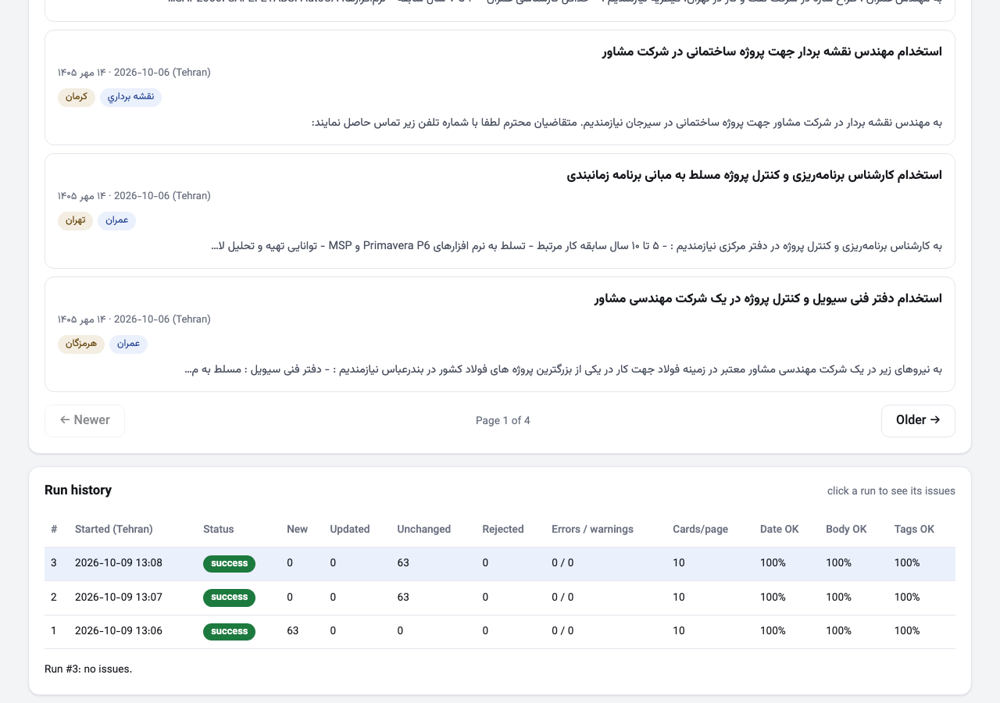
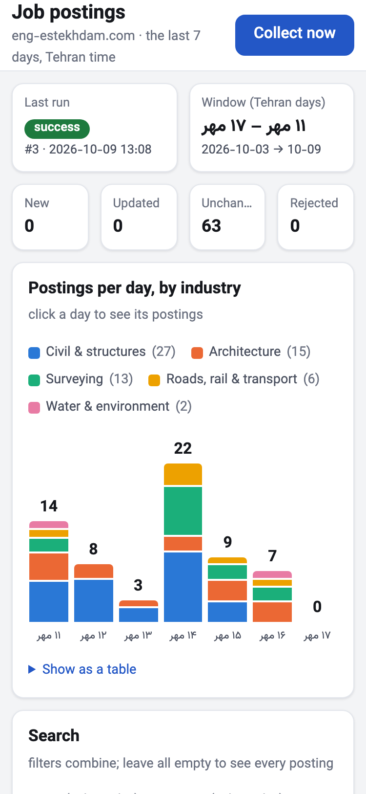
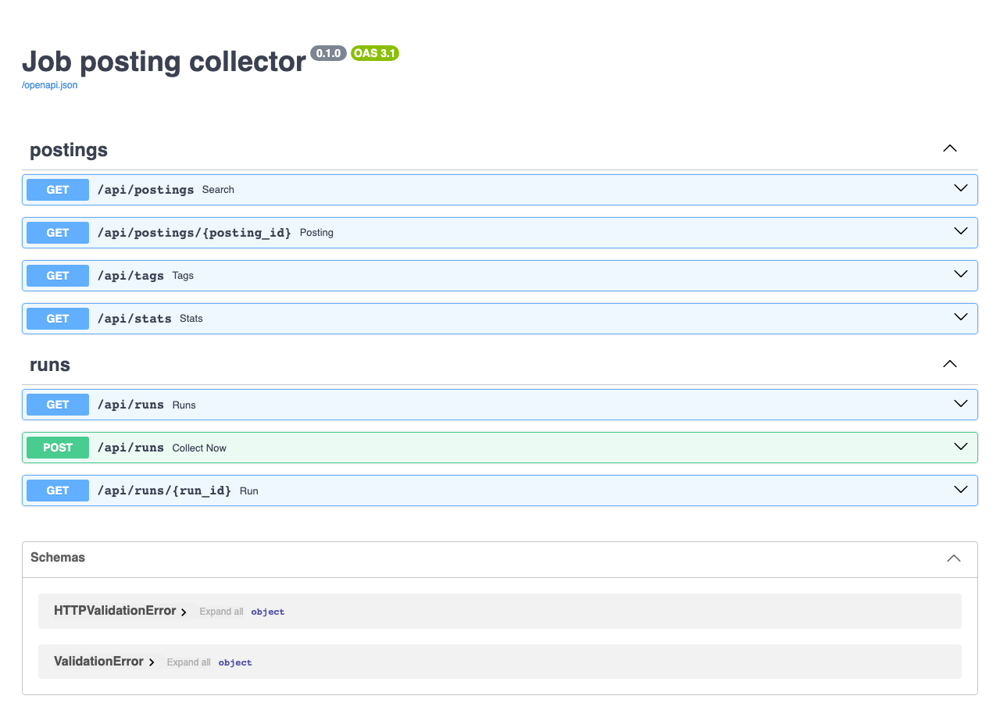
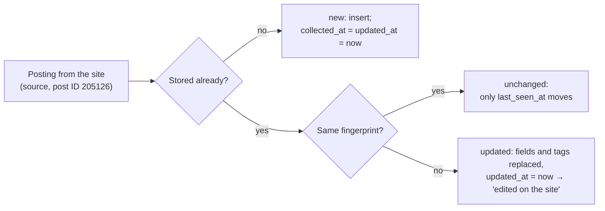

# job-posting-collector

Collects the job postings of the last 7 Tehran days from [eng-estekhdam.com](https://eng-estekhdam.com/)
by reading its HTML, stores them in SQLite with UTC timestamps, and serves them through an HTTP
API and one search page. Every run says whether the whole window was covered and lists each page
or record that failed.

| Live run (fresh clone, 9 Oct) | Tests | Runs on | Time spent |
|---|---|---|---|
| `success`: 63 postings in 38.6 s, 0 rejected; run again: 63 unchanged | 319, offline, about 45 s | Python 3.12 (also tested on 3.14), macOS and Ubuntu | ≈ 9 h 20 min: 8 h 10 min to build (steps 0–8), 1 h 10 min for the final review (step 9) |

**Contents:** [Reviewer's path](#reviewers-path-about-10-minutes) ·
[How the brief is met](#how-the-brief-is-met) · [Design](#design-in-one-page) ·
[Decisions and trade-offs](#decisions-and-trade-offs) · [Commands](#commands) · [The page](#the-page) ·
[API](#api) · [Data handling](#how-data-is-handled) · [Tests](#tests) ·
[Live evidence](#live-collection-evidence) · [Extras](#optional-extras-value-and-cost) ·
[Time and limitations](#time-spent-limitations-and-unfinished-work) · [AI use](#ai-use)

## Reviewer's path (about 10 minutes)



**1. Install** (Python 3.12; 3.13 and 3.14 also work):

```bash
git clone https://github.com/ParhamBeik/job-posting-collector.git && cd job-posting-collector
python3.12 -m venv .venv               # or: uv venv --python 3.12 .venv
source .venv/bin/activate              # Windows: .venv\Scripts\activate
pip install -e ".[dev]"                # or: uv pip install -e ".[dev]"
python -m playwright install chromium  # once, for the browser tests
```

**2. Run the tests** (no network needed; you should see `319 passed`):

```bash
pytest
```

**3. Collect.** Live, from the site (about 70 polite requests, under a minute):

```bash
python -m collector collect
```

You should see `run 1: SUCCESS`, the window in Tehran days and UTC, and the counts. Run it again:
every posting is `unchanged`, nothing is added. If the site is unreachable, replay the committed
copy of the site instead (offline, 68 postings for 1–7 Oct 2026):

```bash
python -m collector collect --from-dir tests/fixtures/eng_estekhdam/snapshot --now 2026-10-07T17:00:00Z
```

**4. Start the API and the page:**

```bash
python -m api
```

**5. Look around:**

| Open | What you see |
|---|---|
| http://127.0.0.1:8000/ | The page: last run, postings per day, search (date range, keyword, tag), results, full text, original link, run history, **Collect now** |
| http://127.0.0.1:8000/docs | Swagger: every route and parameter, with "Try it out" |
| http://127.0.0.1:8000/redoc | The same API reference, as a document |
| http://127.0.0.1:8000/openapi.json | The machine-readable API description |
| http://127.0.0.1:8000/api/postings?q=autocad&tag=civil | Raw JSON of a combined search |
| `var/jobs.db` | The SQLite database (queries below) |
| `var/logs/run-<id>.log` | Output of runs started with Collect now |

The database, with Python's built-in SQLite shell (one statement per command):

```bash
python -m sqlite3 var/jobs.db "SELECT name FROM sqlite_master WHERE type = 'table'"
python -m sqlite3 var/jobs.db "SELECT id, source_post_id, published_at, collected_at, updated_at, title FROM postings ORDER BY published_at DESC LIMIT 5"
python -m sqlite3 var/jobs.db "SELECT p.source_post_id, t.kind, t.slug, t.label FROM posting_tags t JOIN postings p ON p.id = t.posting_id LIMIT 10"
python -m sqlite3 var/jobs.db "SELECT id, status, window_start, window_end, new, updated, unchanged, rejected FROM runs"
python -m sqlite3 var/jobs.db "SELECT run_id, severity, code, url FROM run_issues"
```

`python -m sqlite3 var/jobs.db` alone opens an interactive shell; any SQLite viewer (for example
DB Browser for SQLite) works too. To trace one posting from the site to the page, follow
[`docs/DESIGN.md`](docs/DESIGN.md#trace-of-one-posting-post-205126-from-the-committed-snapshot).

> **Running it on another machine.** The server listens on `127.0.0.1` and answers only to the
> host names `127.0.0.1` and `localhost`, so on your own laptop nothing changes. On a remote box
> or a cloud editor that forwards the port under another name, add that name:
> `python -m api --host 0.0.0.0 --allow-host my-box.example`. There is no login (the brief leaves
> it out) and **Collect now** starts a process, so do not expose the server publicly.

| Documents | |
|---|---|
| [`docs/DESIGN.md`](docs/DESIGN.md) | Components, one run step by step, data model, a posting traced end to end, adding a site, broken-parser handling, security, trade-offs |
| [`docs/TESTING.md`](docs/TESTING.md) | The brief's test areas and every edge case, each with its test |
| [`docs/LIVE_RUN.md`](docs/LIVE_RUN.md) | The live runs and their independent check |
| [`docs/TIME_LOG.md`](docs/TIME_LOG.md), [`docs/AI_NOTES.md`](docs/AI_NOTES.md) | Time per step; every decision about AI output |
| [`PLAN.md`](PLAN.md), [`docs/WORKFLOW.md`](docs/WORKFLOW.md) | The plan agreed before coding (§13 maps every sentence of the brief); how each step was built and reviewed |

## How the brief is met

The brief's "Assessment at a glance", row by row:

| What is assessed | What was done | Check it here |
|---|---|---|
| **Correctness and data quality** | HTML only; full text from each posting page (related ads, widgets and the members-only block removed); Persian dates converted, stored as UTC; the 7-day window and the filters use Tehran days converted to UTC; post ID as identity, so re-runs never duplicate; filters combine with AND | Live run, then an independent script compared all 69 stored postings field by field with the site: [`LIVE_RUN.md`](docs/LIVE_RUN.md) |
| **Design and extensibility** | One adapter file holds everything site-specific; core, storage, API and page never change for a new site; a broken parser is detected, contained and repaired with a test | [`DESIGN.md`](docs/DESIGN.md): diagrams, "adding another source", and a tested table of what each HTML change does to a run |
| **Code clarity and judgment** | About 1,500 lines of Python (comments included) and 400 of JavaScript, no framework on the page, no plugin system; extras listed with their value and cost | [Decisions](#decisions-and-trade-offs), [Extras](#optional-extras-value-and-cost) |
| **Reliability and safe handling** | 319 offline tests; every run ends with an exact status and exit code; incomplete ≠ empty; bounded retries and pacing; a circuit breaker stores nothing when parsing looks broken; scraped text is shown only as text, links only if `http(s)` | [`TESTING.md`](docs/TESTING.md) |
| **Delivery and ownership** | Issue → branch → PR → Codex review → merge commit for every step; README followed from a fresh clone; time from session timestamps; AI decisions logged with how each was verified | [Pull requests](https://github.com/ParhamBeik/job-posting-collector/pulls?q=is%3Apr), [`TIME_LOG.md`](docs/TIME_LOG.md), [`AI_NOTES.md`](docs/AI_NOTES.md) |

What section 5 of the brief asks to submit:

| Item | Where |
|---|---|
| Application code and automated tests | `collector/`, `api/`, `tests/` |
| Real incremental commit history (not squashed) | `git log --graph`: one PR per step, merged with merge commits |
| Setup, tool versions, database initialization | [Reviewer's path](#reviewers-path-about-10-minutes), [Commands](#commands) |
| Commands to collect, start the API and page, run tests | [Reviewer's path](#reviewers-path-about-10-minutes) |
| Example queries, each filter alone and combined | [API](#example-queries) |
| Short design explanation and diagram | [Design in one page](#design-in-one-page), [`DESIGN.md`](docs/DESIGN.md) |
| Live collection evidence | [Live evidence](#live-collection-evidence), [`LIVE_RUN.md`](docs/LIVE_RUN.md) |
| Time spent, known limitations, unfinished work | [Time and limitations](#time-spent-limitations-and-unfinished-work) |
| AI-use note with concrete decisions | [AI use](#ai-use) |

## Design in one page



- **Collector** (`collector/`): decides the Tehran window once, reads listing pages until a card
  is older than the window, fetches each in-window posting page, checks every record, and only
  then stores. Data flows as plain Python objects (`ListingItem`, `Posting`, `Issue`).
- **Adapter** (`collector/sources/eng_estekhdam.py`): turns this site's HTML into those objects.
  **Another site** is one new adapter file, its saved pages and one line in `SOURCES`.
- **Storage** (`collector/storage.py`): SQLite tables `postings`, `posting_tags`, `runs`, `run_issues`.
- **API** (`api/app.py`) reads the database and returns JSON; the **page** (`api/static/`) only
  calls the API.
- **Broken parser:** detected per page and per record on the first run, contained by the breaker
  (nothing stored), repaired with the saved pages of the problem run, a failing test and a replay.

Details and the full diagrams: [`docs/DESIGN.md`](docs/DESIGN.md).

## Decisions and trade-offs

| Decision | Instead of | Why | Whose call |
|---|---|---|---|
| Python, SQLite, FastAPI, plain HTML/JS | A framework or a build step | Small, one process, nothing to install beyond Python | Claude proposed; Parham approved (7 Oct) |
| HTML pages only, even though the RSS feed has exact times | RSS or the WordPress API | The brief forbids feeds and source APIs | The brief |
| Publication time = 00:00 Tehran of the site's date, in UTC | Guessing a time | The pages show only a date; documented as a convention | The brief |
| Identity = the site's post ID, checked on the posting page | URL or title | The URL slug follows the title and changes when it is edited | Claude; kept by Parham when Codex suggested dropping the page check (7 Oct) |
| An edited ad is updated in place; `updated_at` ≠ `collected_at` marks it (shown as "edited on the site") | Keeping old versions | The brief needs no history; an indication of change is enough | Parham (9 Oct) |
| Fetch everything, check, then store; more than 30 % invalid → store nothing | Store as you go | A redesign must not overwrite good data with half-parsed rows | Claude proposed; Parham confirmed 30 % (9 Oct) |
| 0.5 s between requests, one at a time, 3 attempts, 40-page cap | Parallel requests | Measured live: half the time, no firewall reaction; parallel would be impolite | Parham asked to halve the time; measured before changing (9 Oct) |
| Keyword = one phrase, substring, after normalization | Every word anywhere | What the brief describes; predictable | Parham (7 Oct) |
| A full copy of the site saved as test pages | A few hand-picked pages | Whole runs can be tested offline on real HTML | Parham (7 Oct) |
| Collect now runs the same command as a separate process | A thread in the API | Same code as the terminal; a collector crash cannot take the API down | Parham asked for the button; Claude chose the process |

## Commands

```bash
python -m collector init-db                       # create var/jobs.db (safe to repeat; collect and api also create it)
python -m collector --db other.db init-db         # any database file
python -m collector collect                       # live: today + previous 6 days, Tehran
python -m collector collect --from-dir DIR --now 2026-10-07T17:00:00Z   # replay saved pages, offline
python -m api [--db var/jobs.db] [--host 127.0.0.1] [--port 8000] [--allow-host NAME]
pytest                                            # all tests, offline
python scripts/screenshots.py [--db var/jobs.db]  # regenerate the pictures below
```



Requests go one at a time, at least 0.5 s apart, with a named User-Agent. Timeouts, connection
errors, 429 and 5xx are retried at most 3 times (waits 2 s and 4 s); redirects and other 4xx are
reported and never followed. The last lines and the exit code say how the run went:

| Status | Exit | Meaning |
|---|---|---|
| `success` / `success_empty` / `success_with_warnings` | 0 | The whole window was read (`empty`: the site had no postings in it) |
| `partial` | 1 | Window fully read, but some postings were rejected |
| `incomplete` | 2 | The window was not fully read (a listing page failed or ended early, or the 40-page cap was hit) |
| `blocked` | 3 | The site answered with a firewall or challenge page; the run stopped asking |
| `parser_broken` | 4 | Listing page 1 unrecognized, or more than 30 % of records invalid: **nothing stored** |
| `failed` | 5 | A bug (traceback in the run's issues), or the process stopped (no sign of life for 3 minutes) |
| not started | 6 | Another run is in progress |

Each problem is an issue with a code (list in `PLAN.md` §6), stored with the run and shown on the
page. When a run has a problem, every page it read is saved to `var/snapshots/<run id>/`, so the
run can be replayed offline with `--from-dir`. `--now` sets the moment the pages were saved (it
decides the window and the postings' `collected_at`; the run itself is recorded with the real time)
and is refused without `--from-dir`.

## The page



| A posting opened | Run history | Phone |
|---|---|---|
|  |  |  |

| Part | What it does |
|---|---|
| **Last run** + **Collect now** | Status, window and counts. The button starts a run; a progress line updates every 2 s; at the end the status and issue codes show and the data reloads |
| **Postings per day, by industry** | One stacked bar per Tehran day (Jalali and Gregorian labels), split by the site's field tags; hover for numbers, "Show as a table", click a day to filter |
| **Search** | Date from/to (Tehran days, Jalali shown beside), keyword, tag with counts. The filters go into the page URL, so a search can be bookmarked |
| **Results** | Title, date (Jalali and Gregorian, Tehran), tags, snippet, "edited on the site" when the ad changed after first collection. **20, 50 or 100 per page** ("Per page"), with "← Newer · Page 2 of 4 · Older →"; the page and size go into the URL too. Click a posting for the full text, collected / updated / last-seen times (UTC) and the original link |
| **Run history** | **10 runs per page**, newest first, with "Page 1 of 10 · 100 runs" and page buttons, so the page never grows without end; counts and health numbers; click a run for its issues grouped by code. The Last-run tile always shows the newest run |

Scraped text is inserted only as text (`textContent`), never as HTML; links are made only for
`http`/`https` addresses. Every response sends `Content-Security-Policy: default-src 'self'`; the
two API docs pages get a looser policy because they load Swagger from a CDN.

## API



| Route | Returns |
|---|---|
| `GET /api/postings` | Search. `date_from`, `date_to` (`YYYY-MM-DD` Tehran days, both inclusive), `q` (keyword), `tag` (slug or Persian label), `page`, `page_size` (default 20, max 100). Newest first: `{items, total, page, page_size}` |
| `GET /api/postings/{id}` | One posting with its full text |
| `GET /api/tags` | Every tag with its kind, Persian label and count |
| `GET /api/stats` | Postings per Tehran day of the current window, by industry group, and the top tags |
| `GET /api/runs?limit=20&page=1` | Run history, newest first: `{items, total, page, limit}` with status, counts, health numbers, error and warning counts |
| `GET /api/runs/{id}` | One run with its issues grouped by code (counters update while it runs) |
| `POST /api/runs` | **Collect now**: needs header `X-Collect-Trigger: 1` (else 403); 409 if a run is active; else 202 with `run_id`; log in `var/logs/run-<id>.log` |

Filters combine with AND. Timestamps are UTC with `Z`; each posting also has
`published_date_tehran` and `published_date_jalali`. A bad date, `date_from` after `date_to`, or an
out-of-range number is a 422 with a message. Within one day, results are ordered by the site's
post ID, highest first (the site shows no time of day; its IDs follow creation order).

### Example queries

Each filter alone:

```bash
curl "http://127.0.0.1:8000/api/postings?date_from=2026-10-08&date_to=2026-10-08"   # one Tehran day
curl "http://127.0.0.1:8000/api/postings?tag=civil"                                 # tag by slug
curl "http://127.0.0.1:8000/api/postings?q=autocad"                                 # keyword, any case
```

Combined (AND) and more:

```bash
curl "http://127.0.0.1:8000/api/postings?q=AutoCAD&tag=civil&date_from=2026-10-02&date_to=2026-10-08"
curl "http://127.0.0.1:8000/api/postings?tag=civil&date_from=2026-10-03&date_to=2026-10-05"
curl -G "http://127.0.0.1:8000/api/postings" --data-urlencode "q=مهندس عمران"        # Persian phrase
curl -G "http://127.0.0.1:8000/api/postings" --data-urlencode "tag=تهران" -d page=2 -d page_size=10
curl -X POST -H "X-Collect-Trigger: 1" http://127.0.0.1:8000/api/runs               # start a run
curl "http://127.0.0.1:8000/api/runs?limit=1"                                       # follow it
```

Their answers on live data are in [`docs/LIVE_RUN.md`](docs/LIVE_RUN.md).

## How data is handled

### Dates and time zones

```text
card date   ۱۴ مهر ۱۴۰۵  →  14 Mehr 1405  →  2026-10-06 (Tehran day)  →  00:00 Tehran  →  stored 2026-10-05T20:30:00Z
```

- The source shows only a Persian (Jalali) date, with no time of day; `jdatetime` converts it.
- **Storage convention:** the publication timestamp is **00:00 in Tehran** on that day, stored in
  UTC. It is not an observed publication time; the source page does not show one.
- Every stored and returned timestamp is UTC, ISO 8601 with `Z`.
- Tehran's offset comes from the `Asia/Tehran` time-zone database (`zoneinfo` + pinned `tzdata`),
  never a fixed `+03:30`, so past dates with daylight saving time stay correct.
- **Collection window:** "today" is decided in Tehran once, at the start of a run. The window is
  today and the previous six Tehran days, as a UTC range that includes the first midnight and
  excludes the midnight after the last day. A run at 01:00 Tehran on 8 Oct (still 7 Oct in UTC)
  collects 2–8 Oct; a run that crosses midnight keeps its window; a card dated after today is
  skipped with a `DATE_AFTER_WINDOW` warning and collected by the next run.
- **Date filters** use the same rule: `date_from=2026-10-04&date_to=2026-10-06` means
  `2026-10-03T20:30:00Z <= published_at < 2026-10-06T20:30:00Z`.
- An unreadable date (unknown month, impossible day such as 31 Mehr) is an error, never guessed.

### Search normalization and case handling

Stored text and queries go through the same `normalize()`: Latin letters are case-folded
(`AutoCAD` = `autocad`); Arabic `ي`/`ك` become Persian `ی`/`ک` (the source mixes both); Persian and
Arabic-Indic digits become `0–9`; the half-space (zero-width non-joiner) and repeated whitespace
become one space. The keyword is one phrase, matched as a substring of title + body; `%` and `_`
are literal characters.

### Tag mapping

Tags come only from the posting's own labels on the source. Nothing is generated, and the
site-wide menu is never copied onto a posting.

| Source label | Stored tag | Where it is read |
|---|---|---|
| Province category, e.g. `category-tehran` → "تهران" | `kind=province`, `slug=tehran`, `label=تهران` | article class on the card; `rel="category tag"` link on the posting page (an ad can name two provinces) |
| Field tag, e.g. `tag-civil` → "عمران" | `kind=field`, `slug=civil`, `label=عمران` | article class on the card; `.entry-tags a[rel=tag]` on the posting page |

The posting page's labels are stored; if they differ from the card's, a `TAGS_MISMATCH` warning
is recorded. Field tags seen on the site (labels as the site writes them):

| slug | label | slug | label |
|---|---|---|---|
| `civil` | عمران | `structure` | سازه |
| `memari` | معماری | `marine` | سازه دریایی |
| `surveying` | نقشه برداري | `hydraulic` | سازه هیدرولیکی |
| `road` | راه ترابری | `geotechnic` | خاک پی |
| `rail` | راه آهن | `earthquake` | زلزله |
| `water` | آب فاضلاب | `environment` | محیط زیست |
| `transportation` | حمل نقل | `management` | مدیریت ساخت |

The chart's industry groups are built from these field tags; the rule is in
[`docs/DESIGN.md`](docs/DESIGN.md#industry-groups-for-the-chart).

### Identity of a posting and how changes are handled



- **Identity:** `(source, source_post_id)`, the site's own WordPress post ID, enforced by a
  `UNIQUE` constraint. Not the URL or title: the URL slug is built from the title and changes
  when the title is edited.
- **Fingerprint:** a SHA-256 of everything stored from the source (URL, title, body, date, tags,
  members-only flag). `collected_at` is the first time a posting was stored and never changes;
  `updated_at` moves only when the content changed; `last_seen_at` moves on every run that sees it.
- **No data loss:** an empty new title, body, URL or tag label never overwrites stored text; the
  stored value is kept and an `EMPTY_FIELD_KEPT` warning is recorded. Old postings are never deleted.
- `members_only_omitted = 1` marks postings whose contact section was members-only on the source
  and therefore not collected (no login, no bypass).

## Tests

319 tests, all offline: unit tests (dates, text, parser, storage), whole runs on the saved copy of
the site with failures injected, the API, and a real browser (Chromium) for the page.
[`docs/TESTING.md`](docs/TESTING.md) maps each of the brief's six test areas and every edge case
to its test. A few of the edge cases:

| Situation | What happens |
|---|---|
| Run at 01:00 Tehran (still yesterday in UTC), or crossing midnight | The window is the Tehran day decided at the start |
| An empty listing page before the window ends (the site answers 200) | `incomplete`, never "no more postings" |
| A new ad pushes another onto the next page mid-run | Read twice, stored once |
| The site redesigns its pages | `parser_broken`, nothing stored, pages saved for repair |
| ``, `javascript:` links in scraped text | Shown as text, never run (browser test) |
| Huge page numbers or IDs, SQL text, emoji, 20 000 characters | A normal answer or a 422, never a 500 |

## Live collection evidence

[`docs/LIVE_RUN.md`](docs/LIVE_RUN.md) records two live checks, each from a fresh clone:

| | Window (Tehran) | Result | Run again |
|---|---|---|---|
| 8 Oct | 2026-10-02 .. 2026-10-08 (`2026-10-01T20:30:00Z` .. `2026-10-08T20:30:00Z`) | `success`, **69 postings**, 0 rejected, 76 requests, 1 min 17 s | unchanged; an independent script re-read all 76 pages and found every field matching |
| 9 Oct | 2026-10-03 .. 2026-10-09 (`2026-10-02T20:30:00Z` .. `2026-10-09T20:30:00Z`) | `success`, **63 postings**, 0 rejected, 70 requests, 38.6 s | 63 unchanged, twice (terminal and Collect now) |

No firewall challenge or login wall was met. The members-only contact block was left out of every
body, as designed, and flagged on each row.

## Optional extras: value and cost

The brief asks only for the core; these were added on top, most at my request during planning
and review (times from the Claude Code session, Tehran). Each can be removed without touching the core.

| Extra | Why (who asked) | Value | Cost |
|---|---|---|---|
| **Collect now** button | I asked, 7 Oct 19:51, so collecting needs no terminal | One click; runs the same command as the terminal | An endpoint that starts a process, so it needs guards: localhost only, trigger header, host-name check, one-run lock |
| Run monitor, run history, issue codes | I asked for monitoring visuals and clearer error states, 7 Oct 19:12 | An incomplete or broken run is visible on the page, with the exact pages and codes | Two read-only routes and one page panel |
| Dead-run detection by heartbeat | Needed by Collect now; I questioned the first 30-minute guess, 8 Oct 16:37 | A crashed run stops blocking Collect now after 3 minutes | One column, one update per request |
| Per-day chart, split by industry | I asked for visuals, 7 Oct 19:12; the industry split was my idea, 8 Oct evening | Volume per day and field at a glance; click a day to filter | `/api/stats`, a 23-line grouping file, chart code |
| Swagger and ReDoc at `/docs` | I asked to keep them, 8 Oct 16:14 | Try every endpoint in a browser | A looser CSP on those two pages only |
| Snapshot replay (`--from-dir`, `--now`) | Claude's proposal in the plan, for the repair flow | Reproduce a problem run offline; the tests use the same path | A 15-line replay fetcher and a guard that refuses `--now` on live runs |
| Search copied into the page URL | Claude's proposal in the plan | A search can be bookmarked or shared | A few lines of page code |
| Persian font, phone layout | I asked, 8 Oct 21:56 | Readable Persian; usable on a phone | One self-hosted font file (SIL OFL), CSS |

## Time spent, limitations and unfinished work

**≈ 8 h 10 min for steps 0–8**, measured from the timestamps of the Claude Code sessions for this
repository (7 Oct 17:58–22:16, 8 Oct 13:31–17:02 and 21:56–22:15, Tehran time), plus **1 h 10 min
for step 9**, the final review against the brief, fixes, paging and a fresh-clone check (8 Oct
22:25–22:58, 9 Oct 12:47–13:15 and 13:57–14:05): **≈ 9 h 20 min in all**. Per step in [`docs/TIME_LOG.md`](docs/TIME_LOG.md). An earlier version of this README said
7 h 30 min from memory; it left out the 8 Oct evening.

Known limitations:

- One source; runs are started by hand (no scheduler, as the brief allows).
- No login, so the server must stay on `127.0.0.1` (or a name you allow with `--allow-host`).
- Within one day, order follows the site's post IDs, because the site shows no times.
- Members-only contact details are never collected.
- If an ad is deleted from the site **during** a run, the ads after it move up one place, and one
  ad can slip past the listing pages already read. It is not reported. The next run collects it
  unless it has left the window by then. A fix is designed but not built
  ([`docs/DESIGN.md`](docs/DESIGN.md#trade-offs-limitations-and-what-was-left-out)).

Designed but not built: a health drift alert, a layout fingerprint, a per-source on/off switch,
and the listing re-check above ([`docs/DESIGN.md`](docs/DESIGN.md#a-broken-parser-prevent-detect-contain-isolate-repair)).

## AI use

Claude Code wrote the plan, code, tests and docs with me, step by step; Codex reviewed every pull
request as a second reviewer. Every AI output was checked against the live site, a test or a
measurement before it was kept. Three examples (full log: [`docs/AI_NOTES.md`](docs/AI_NOTES.md)):

1. **Changed: "an empty listing page means there are no more postings."** Checked on the live
   site: `/page/99999/` answers HTTP 200 with zero ads, so an empty page proves nothing. Now an
   empty page before the window ends is `LISTING_EMPTY_EARLY` and the run is `incomplete`, never
   a quiet success; a test covers it.
2. **Changed: read the posting text from `article.typology-post`.** A live posting page holds six
   such articles (the ad plus five related ads), so the body would have mixed ads. Now only the
   main `typology-single-post` article is read, its post ID must equal the card's, and a test with
   a related ad placed first proves it.
3. **Rejected after questioning: a fixed 30-minute limit to declare a run dead.** The number was a
   guess. Replaced by a heartbeat after every request and a 3-minute limit derived from the
   longest healthy silence (one request with all retries, about 97 s); verified by killing a live
   run, which was marked `failed` after 3 minutes and no longer blocked Collect now.
