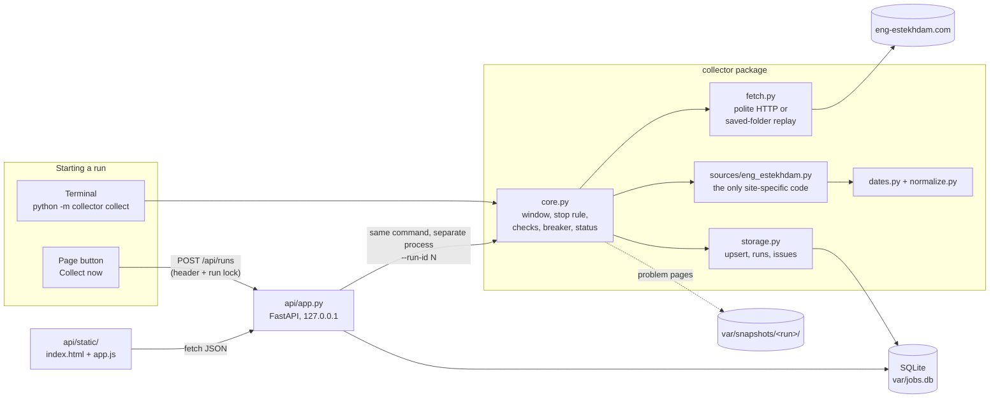
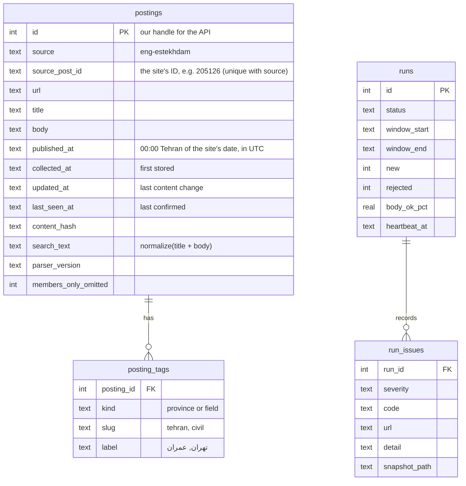

# Design

The app copies the last 7 Tehran days of job postings from eng-estekhdam.com into SQLite, lets
people search them over HTTP and on one page, and reports, for every run, exactly how complete the
copy is. This document explains the parts, how one run flows, how another site is added, how a
broken parser is caught and repaired, and what was traded off. The full plan with every decision
is in [`PLAN.md`](../PLAN.md).

## Components



| Part | Job | Knows about the site? |
|---|---|---|
| `collector/core.py` | One run: decide the window once, read listing pages until a card older than the window, fetch each in-window posting, check everything, then store; set the status | No |
| `collector/fetch.py` | `HttpFetcher`: one request at a time, ≥ 1 s apart, timeouts, at most 3 attempts, no redirects. `DirFetcher`: the same interface over a saved folder (tests and replay) | No |
| `collector/sources/eng_estekhdam.py` | The adapter: URLs, page checks, selectors, what counts as body, tag mapping, record checks | **Yes, only here** |
| `collector/dates.py`, `normalize.py` | Jalali → Gregorian, Tehran day ↔ UTC range, one text normalization for search and tags | No |
| `collector/storage.py` | Schema, insert-or-update by `(source, source_post_id)`, run rows with heartbeat, issues | No |
| `api/app.py` | Search and run endpoints, Collect now, security headers | No |
| `api/static/` | The page: plain HTML/CSS/JS, text-only rendering | No |

## One run, step by step

1. **Start.** `start_run()` takes the database write lock and inserts a `running` row, or refuses
   if a live run exists (exit 6, or 409 from the API). One function serves the terminal and the
   button, so "one run at a time" has one rule.
2. **Window.** "Now" is read once. Today in Tehran and the 6 days before become a half-open UTC
   range `[start, end)`; the offset comes from the time-zone database (Iran used daylight saving
   until 2022), never a hard-coded +03:30.
3. **Listing pages** `/`, `/page/2/`, … Each page is checked first (is it really a listing? a
   firewall page?). Each card gives post ID, URL, title, date and tags, each validated. Reading
   stops at the first card older than the window; if the order is ever broken, only a page that is
   entirely older stops it. A page with no cards before that point is `LISTING_EMPTY_EARLY`
   (`incomplete`), never "no more postings". Safety cap: 40 pages.
4. **Posting pages** for in-window cards only. The page must carry the same post ID as the card,
   the same date, and a title that matches; the body is the article text minus scripts, the report
   widget, the members-only contact block, tag links and hidden elements.
5. **Breaker.** If listing page 1 is unrecognizable, or more than 30 % of at least 5 records failed
   their checks, nothing is stored and the status is `parser_broken`. Everything was fetched and
   checked before this point, so a bad parse can never half-overwrite good data.
6. **Store.** Each posting is inserted or updated in its own transaction. Unchanged content only
   moves `last_seen_at`; an empty new title, body, URL or tag label never overwrites a stored one.
7. **Finish.** Counters, health numbers and every issue (with its code, URL and saved page) are
   written; the status says whether the window was fully covered.

| Status | Exit | Meaning |
|---|---|---|
| `success`, `success_empty`, `success_with_warnings` | 0 | whole window read |
| `partial` | 1 | whole window read, some postings rejected |
| `incomplete` | 2 | window not fully read |
| `blocked` | 3 | firewall / challenge page; stopped asking |
| `parser_broken` | 4 | breaker tripped; nothing stored |
| `failed` | 5 | a bug, or the process died (no heartbeat for 3 min) |

## Data model



- **Identity** is the site's post ID, read from the card and checked on the posting page. Not the
  URL (its slug follows the title and changes on edits) and not the title.
- **Dates:** the site shows only a day. `published_at` is 00:00 Tehran of that day, stored in UTC
  (e.g. ۱۵ مهر ۱۴۰۵ → `2026-10-06T20:30:00Z`): a stated convention, not an observed time.
- **Changes:** a content hash over URL, title, body, date, tags and the members-only flag decides
  `new` / `updated` / `unchanged`. Nothing is ever deleted.

## Trace of one posting (post 205126, from the committed snapshot)

```text
listing page 1   <article class="typology-post ... post-205126 ... category-tehran tag-memari">
                 date  <... class="post-date-hidden">۱۵ مهر ۱۴۰۵</...>
                 link  https://eng-estekhdam.com/1405/07/15/<slug>/        (URL date agrees)
      │ parse_listing → ListingItem(205126, url, title, 2026-10-07, tehran + memari)
      ▼
posting page     <article id="post-205126" class="typology-single-post ...">  same ID ✓
                 h1 "استخدام طراح فاز دو و دیتیل اجرایی غرفه ..."  same title ✓, same date ✓
      │ parse_posting → Posting(body 862 chars, members_only_omitted = 1)
      ▼
postings row     id 1 · source_post_id 205126 · published_at 2026-10-06T20:30:00Z
posting_tags     (field, memari, معماری) · (province, tehran, تهران)
      ▼
API              GET /api/postings/1 → published_date_tehran 2026-10-07,
                 published_date_jalali 1405-07-15, tags, body, url
      ▼
page             result row: title, "1405-07-15 · 2026-10-07 (Tehran)", chips معماری تهران;
                 detail: body as text, "Open original ↗" (https only, rel="noopener noreferrer")
```

## Adding another source

The core asks every site the same five things ([`collector/sources/__init__.py`](../collector/sources/__init__.py)):

```python
class Source(Protocol):
    name: str                      # "eng-estekhdam"
    parser_version: str            # "eng-estekhdam/1"
    def listing_url(self, page: int) -> str: ...
    def check_page(self, html: str, kind: str) -> str | None: ...       # None, or an issue code
    def parse_listing(self, html: str) -> tuple[list[ListingItem], list[Issue]]: ...
    def parse_posting(self, html: str, item: ListingItem) -> tuple[Posting | None, list[Issue]]: ...
```

Site B = `collector/sources/site_b.py` + its saved pages in `tests/fixtures/site_b/` + one line in
`SOURCES`. Core, fetching, storage, API and page are untouched; `source` is part of every
posting's identity, so two sites cannot collide. `collect --source site_b` runs one site, so a
broken site never stops another. Deliberately no plugin loader or configuration format: with one
site it would be machinery without a user.

## A broken parser: prevent, detect, contain, isolate, repair

Sites change their HTML without notice. The aim is that a change is **noticed on the first run,
stores nothing wrong, and is fixed with a test**.

| Layer | Built | How |
|---|---|---|
| Prevent | ✅ | Elements chosen by meaning (post-ID class, `rel="tag"`, the date element), not position; main article only (related ads ignored) |
| Detect, per page | ✅ | `check_page`: is it a listing / posting of this theme, or a firewall page? (`LAYOUT_UNRECOGNIZED`, `BLOCKED_CHALLENGE`) |
| Detect, per record | ✅ | Each card and posting checked: ID, link host, date parses and agrees, title agrees, body not empty (§6 codes in `PLAN.md`) |
| Detect, across runs | ✅ numbers / 📝 alert | Health numbers stored per run and shown on the page (cards per page, % date/body/tags OK). Designed, not built: alert when they drop 20 points below the last 10 runs' median; a layout fingerprint; a daily one-page smoke run |
| Contain | ✅ | Fetch everything first; breaker stores nothing when the parse looks broken; rejected records never enter `postings`; empty values never overwrite stored ones |
| Isolate | ✅ / 📝 | `--source` runs one site. Designed, not built: an `enabled = false` switch per source |
| Repair | ✅ | Problem runs save every page they read to `var/snapshots/<run>/` with a manifest. Copy the page into `tests/fixtures/`, write a failing test, fix the selector, bump `parser_version`, replay the folder offline with `collect --from-dir … --now …`, then collect live; the upsert refreshes rows and records the new parser version |

## Untrusted HTML and the page

Everything from the site is data, never code or instructions:

- **Parsing:** BeautifulSoup reads the HTML; only text is kept. Scripts, widgets, hidden elements
  and the members-only block are removed before the body is taken, so hidden text planted for
  readers or tools is not stored either.
- **Showing:** the page builds every element with `createElement` and puts site text in with
  `textContent`, never `innerHTML`; links are made only for `http:`/`https:` addresses, with
  `rel="noopener noreferrer"`. `tests/test_page_xss.py` loads a malicious posting in a real
  browser and checks that `` shows as characters and never runs.
- **Second layer:** `Content-Security-Policy: default-src 'self'` on every response: no inline or
  foreign scripts. With HTML insertion switched on in a test, the CSP alone still stopped the
  attack; both had to be removed for it to run. The FastAPI docs pages (`/docs`, `/redoc`) get a
  looser policy because they load Swagger/ReDoc from a CDN; they show only our own API schema.
- **Collect now** starts a process, and there is no login (out of scope), so: the server binds
  `127.0.0.1` by default; the request needs the header `X-Collect-Trigger: 1`, which another
  website cannot add to a request without a CORS permission we never grant; one run at a time.

## Trade-offs, limitations and what was left out

| Choice | Why | Cost |
|---|---|---|
| Midnight-Tehran timestamp for date-only postings | The HTML shows only a day; the RSS feed (which has times) is off-limits | Within one day, newest = highest site post ID (creation order), not a true time; an ad created early and published late sorts a little low |
| Keyword = one phrase, substring after normalization | What the brief describes; predictable | "عمران مهندس" does not find "مهندس عمران"; word-by-word search is a possible next step |
| SQLite `LIKE`, no full-text index | About 70 postings a week; the brief excludes a search engine | Would need FTS5 at a much larger size |
| Separate process for Collect now | Same code as the terminal; a collector crash cannot take the API down | One more moving part (log in `var/logs/`) |
| Heartbeat every request, dead after 3 min | Longest healthy silence ≈ 97 s (one request with all retries) | A run frozen mid-request for over 3 min would be marked failed, then finish normally |
| Full site snapshot as fixtures | Tests are offline, deterministic and cover real HTML | Repository is larger; refreshing it is a deliberate, reviewed change |

**Known limitations:** single source; no scheduling (runs are started by hand, as the brief asks);
no authentication, so the server must stay on localhost; the drift alert, layout fingerprint and
per-source switch are designed but not built; members-only contact details are never collected
(no login, no bypass).

**Deliberately out of scope (brief or ethics):** RSS feeds and the WordPress JSON API; logging in
or getting around `rcp_restricted`; AI-generated tags; a search engine; Docker or deployment.
