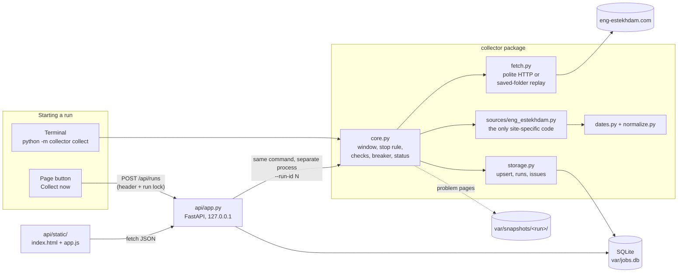
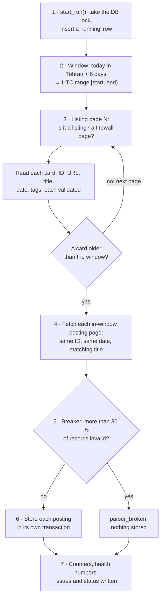
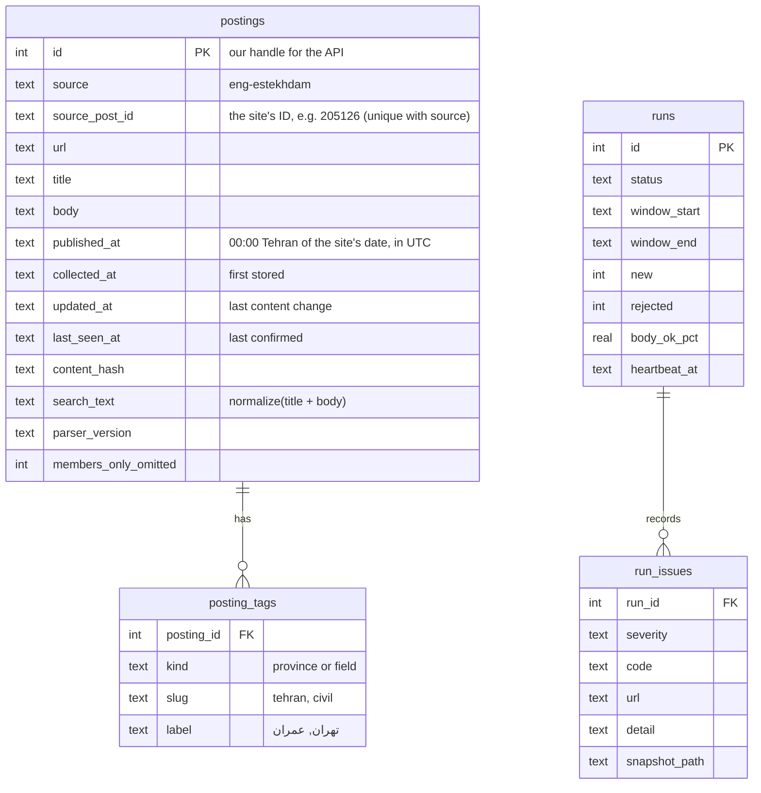
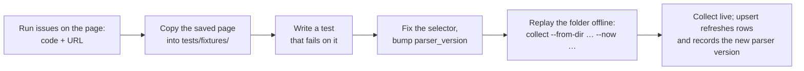

# Design

The app copies the last 7 Tehran days of job postings from eng-estekhdam.com into SQLite. People
search them over HTTP and on one page, and every run reports exactly how complete the copy is.
This document covers the parts, one run, the data, adding a site, a broken parser, untrusted HTML
and the trade-offs. The plan agreed before coding, with every decision, is in [`PLAN.md`](../PLAN.md).

## Components



| Part | Job | Knows the site? |
|---|---|---|
| `collector/core.py` | One run: decide the window once, read listing pages until a card is older than the window, fetch each in-window posting, check everything, then store; set the status | No |
| `collector/fetch.py` | `HttpFetcher`: one request at a time, ≥ 0.5 s apart, timeouts, at most 3 attempts, no redirects. `DirFetcher`: the same interface over a saved folder (tests and replay) | No |
| `collector/sources/eng_estekhdam.py` | The adapter: URLs, page checks, selectors, what counts as body, tag mapping, record checks | **Yes, only here** |
| `collector/dates.py`, `normalize.py` | Jalali → Gregorian, Tehran day ↔ UTC range, one text normalization for search and tags | No |
| `collector/storage.py` | Schema, insert-or-update by `(source, source_post_id)`, run rows with heartbeat, issues | No |
| `collector/industry.py` | Industry groups for the chart (see [below](#industry-groups-for-the-chart)) | No |
| `api/app.py` | Search and run endpoints, Collect now, security headers | No |
| `api/static/` | The page: plain HTML/CSS/JS, text-only rendering | No |

## One run, step by step



1. **Start.** `start_run()` takes the database write lock and inserts a `running` row, or refuses
   if a live run exists (exit 6, or 409 from the API). The terminal and the button share this one
   function, so "one run at a time" has one rule.
2. **Window.** "Now" is read once. Today in Tehran and the 6 days before become a half-open UTC
   range `[start, end)`. The offset comes from the time-zone database (Iran used daylight saving
   until 2022), never a hard-coded +03:30.
3. **Listing pages** `/`, `/page/2/`, … Each page is checked before it is parsed. Reading stops at
   the first card older than the window; if the newest-first order is ever broken, only a page that
   is entirely older stops it. A page with no cards before that point is `LISTING_EMPTY_EARLY`
   (`incomplete`), never "no more postings". A card dated after today is skipped with a
   `DATE_AFTER_WINDOW` warning (for example, an ad posted after midnight while the run was going;
   the next run collects it). Safety cap: 40 pages.
4. **Posting pages**, for in-window cards only. The page must carry the card's post ID and date,
   and a matching title. The body is the main article's text without scripts, the report widget,
   the members-only contact block, tag links and hidden elements.
5. **Breaker.** If listing page 1 is unrecognizable, or more than 30 % of at least 5 records fail
   their checks, nothing is stored and the status is `parser_broken`. Everything is fetched and
   checked before this point, so a bad parse never half-overwrites good data.
6. **Store.** Each posting is inserted or updated in its own transaction. Unchanged content only
   moves `last_seen_at`; an empty new title, body, URL or tag label never overwrites a stored one.
7. **Finish.** Counters, health numbers and every issue (code, URL, saved page) are written; the
   status says whether the whole window was covered. The exit codes are in the README.

A replay (`--from-dir` with `--now`) reads saved pages instead of the site. `--now` decides the
window and stamps the postings; the run row itself (start, heartbeat, finish) gets the real time.

## Data model



Identity, dates and change handling are explained in the
[README](../README.md#how-data-is-handled): identity is the site's post ID (not the URL, whose
slug follows the title), `published_at` is 00:00 Tehran of the site's date as a stated
convention, and a content fingerprint decides `new` / `updated` / `unchanged`. An ad whose
`updated_at` differs from `collected_at` was edited on the site; the page marks it. Nothing is deleted.

## Trace of one posting (post 205126, from the committed snapshot)

```text
listing page 1   <article class="typology-post ... post-205126 ... category-tehran tag-memari">
                 date  <... class="post-date-hidden">۱۵ مهر ۱۴۰۵</...>
                 link  https://eng-estekhdam.com/1405/07/15/<slug>/        (URL date agrees)
      │ parse_listing → ListingItem(205126, url, title, 2026-10-07, tehran + memari)
      ▼
posting page     <article id="post-205126" class="typology-single-post ...">  same ID ✓
                 h1 "استخدام طراح فاز دو و دیتیل اجرایی غرفه ..."  same title ✓, same date ✓
      │ parse_posting → Posting(body 862 chars, members_only_omitted = 1)
      ▼
postings row     id 1 · source_post_id 205126 · published_at 2026-10-06T20:30:00Z
posting_tags     (field, memari, معماری) · (province, tehran, تهران)
      ▼
API              GET /api/postings/1 → published_date_tehran 2026-10-07,
                 published_date_jalali 1405-07-15, tags, body, url
      ▼
page             result row: title, "1405-07-15 · 2026-10-07 (Tehran)", chips معماری تهران;
                 detail: body as text, "Open original ↗" (https only, rel="noopener noreferrer")
```

## Adding another source

The core asks every site the same things ([`collector/sources/__init__.py`](../collector/sources/__init__.py)):

```python
class Source(Protocol):
    name: str                      # "eng-estekhdam"
    parser_version: str            # "eng-estekhdam/1"
    def listing_url(self, page: int) -> str: ...
    def check_page(self, html: str, kind: str) -> str | None: ...       # None, or an issue code
    def parse_listing(self, html: str) -> tuple[list[ListingItem], list[Issue]]: ...
    def parse_posting(self, html: str, item: ListingItem) -> tuple[Posting | None, list[Issue]]: ...
```

```text
collector/sources/site_b.py      the adapter: URLs, selectors, checks      (new)
tests/fixtures/site_b/           its saved pages                           (new)
collector/sources/__init__.py    SOURCES = {..., "site-b": SiteB()}        (one line)
core, fetch, storage, API, page  unchanged
```

`source` is part of every posting's identity, so two sites cannot collide, and
`collect --source site_b` runs one site, so a broken site never stops another. Deliberately no
plugin loader or configuration format: with one site it would be machinery without a user.

## A broken parser: prevent, detect, contain, isolate, repair

Sites change their HTML without notice. The aim: a change is **noticed on the first run, stores
nothing wrong, and is fixed with a test**.

| Layer | Built | How |
|---|---|---|
| Prevent | ✅ | Elements chosen by meaning (post-ID class, `rel="tag"`, the date element), not position; main article only (related ads ignored) |
| Detect, per page | ✅ | `check_page`: is it a listing or posting of this theme, or a firewall page? (`LAYOUT_UNRECOGNIZED`, `BLOCKED_CHALLENGE`) |
| Detect, per record | ✅ | Each card and posting checked: ID, link host, date parses and agrees, title agrees, body not empty (codes in `PLAN.md` §6) |
| Detect, across runs | ✅ numbers / 📝 alert | Health numbers stored per run and shown on the page (cards per page, % date/body/tags OK). Designed, not built: alert when they drop 20 points below the last 10 runs' median; a layout fingerprint; a daily one-page smoke run |
| Contain | ✅ | Fetch everything first; the breaker stores nothing when the parse looks broken; rejected records never enter `postings`; empty values never overwrite stored ones |
| Isolate | ✅ / 📝 | `--source` runs one site. Designed, not built: an `enabled = false` switch per source |
| Repair | ✅ | Problem runs save every page they read to `var/snapshots/<run>/` with a manifest |

What happens for some concrete changes (each one run against the committed snapshot with the
change applied to every page):

| If the site… | Run status | Stored | Issues |
|---|---|---|---|
| removes the card date element | `success_with_warnings` | 68 | `FALLBACK_USED` × 70 (the validated URL date is used; the posting page date is still checked) |
| renames the card class `typology-post` | `incomplete` | 0 | `LISTING_EMPTY_EARLY` on page 1 |
| renames the posting body `.entry-content` | `parser_broken` | 0 | `FIELD_MISSING` × 68, `BREAKER_TRIPPED` |
| changes its theme (body classes) | `parser_broken` | 0 | `LAYOUT_UNRECOGNIZED`, `BREAKER_TRIPPED` |
| shows a firewall page | `blocked` | 0 | `BLOCKED_CHALLENGE` |



## Untrusted HTML and the page

Everything from the site is data, never code or instructions:

- **Parsing:** BeautifulSoup reads the HTML and only text is kept. Scripts, widgets, hidden
  elements and the members-only block are removed before the body is taken, so hidden text planted
  for readers or tools is not stored either.
- **Showing:** the page builds every element with `createElement` and puts site text in with
  `textContent`, never `innerHTML`. Links are made only for `http:`/`https:` addresses, with
  `rel="noopener noreferrer"`. `tests/test_page_xss.py` loads a malicious posting in a real browser
  and checks that `` shows as characters and never runs.
- **Second layer:** `Content-Security-Policy: default-src 'self'` on every response, so no inline
  or foreign scripts run. With HTML insertion switched on in a test, the CSP alone still stopped
  the attack; both had to be removed for it to run. The docs pages (`/docs`, `/redoc`) get a looser
  policy because they load Swagger/ReDoc from a CDN; they show only our own API schema.
- **Collect now** starts a process and there is no login (out of scope), so: the server binds
  `127.0.0.1`; the request needs the header `X-Collect-Trigger: 1`, which another website cannot add
  without a CORS permission we never grant; requests whose `Host` is not `127.0.0.1`, `localhost` or a name
  allowed with `--allow-host` get a 400, which stops DNS rebinding (a hostile site pointing its own name at 127.0.0.1 to look
  same-origin); and only one run at a time.

## Industry groups (for the chart)

The chart groups the site's field tags into six industries; nothing is guessed from the text. An
ad with several field tags is counted **once**, in its most specific group (priority 1 first), so
each day's segments add up to that day's ads. An ad without a known field tag is "Other".

| Group | Field tags (slugs) | Priority |
|---|---|---|
| Surveying | `surveying` | 1 |
| Architecture | `memari` | 2 |
| Roads, rail & transport | `road`, `rail`, `transportation` | 3 |
| Water & environment | `water`, `environment` | 4 |
| Construction management | `management` | 5 |
| Civil & structures | `civil`, `structure`, `marine`, `hydraulic`, `geotechnic`, `earthquake` | 6 (the broadest: on about 2 of 3 ads) |

The tag → group map is in the adapter (`field_groups`); the groups and the rule are in
`collector/industry.py`.

## Trade-offs, limitations and what was left out

| Choice | Why | Cost |
|---|---|---|
| Midnight-Tehran timestamp for date-only postings | The HTML shows only a day; the RSS feed (which has times) is off-limits | Within one day, newest = highest site post ID (creation order), not a true time; an ad created early and published late sorts a little low |
| Keyword = one phrase, substring after normalization | What the brief describes; predictable | "عمران مهندس" does not find "مهندس عمران"; word-by-word search is a possible next step |
| SQLite `LIKE`, no full-text index | About 70 postings a week; the brief excludes a search engine | Would need FTS5 at a much larger size |
| Separate process for Collect now | Same code as the terminal; a collector crash cannot take the API down | One more moving part (log in `var/logs/`) |
| 0.5 s between requests, one at a time | Measured live: 70 requests in 43 s, all HTTP 200, no firewall reaction | Twice the load of 1 s; parallel requests were ruled out as impolite |
| Heartbeat every request, dead after 3 min | Longest healthy silence ≈ 97 s (one request with all retries) | A run frozen mid-request for over 3 min would be marked failed, then finish normally |
| Full site snapshot as fixtures | Tests are offline, deterministic and cover real HTML | Repository is larger; refreshing it is a deliberate, reviewed change |
| Read listing pages once, in order | Simple; the same pages the site shows | A deletion during a run can hide one ad (below) |

**Listing pages can shift during a run.** The site's pages are slices of one list: page 2 is ads
11–20 *at the moment it is read*.

```text
read page 1:  [A B C D E F G H I J]          then the site deletes ad C
read page 2:  [L M N O P Q R S T U]          ad K moved up onto page 1, which was already read
                                             → K is never seen in this run
```

- A **new** ad pushes everything down one place: the last ad of page N shows again on page N+1. It
  is read twice, de-duplicated by post ID, and nothing is lost.
- A **deleted** ad pulls everything up one place, on any page: the first ad of the next page lands
  on a page already read, and this run never sees it. Nothing reports it. The next run collects it,
  unless it has left the window by then.
- Designed fix, not built: after the posting pages, read the in-window listing pages once more and
  fetch any in-window ad not already seen, with a warning. Cost: about 7 more requests (7 s); the
  fetchers and the adapter stay as they are. A miss would then need a second deletion at the exact
  same moment of the second pass.

**Known limitations:** single source; no scheduling (runs are started by hand, which the brief
allows); no authentication, so the server must stay on localhost; the drift alert, layout
fingerprint, per-source switch and listing re-check are designed but not built; members-only
contact details are never collected (no login, no bypass).

**Deliberately out of scope (brief or ethics):** RSS feeds and the WordPress JSON API; logging in
or getting around `rcp_restricted`; AI-generated tags; a search engine; Docker or deployment.
