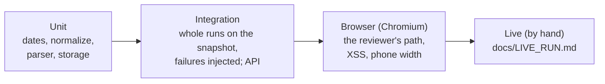

# Testing and verification

```bash
pytest                                  # 319 tests, about 45 s, no network
```

Every test runs without the live website: pages come from the saved snapshot in
`tests/fixtures/eng_estekhdam/` (real pages captured 2026-10-07T17:00Z) or from small hand-made
pages. The clock is injected, so dates never depend on the day you run the tests. GitHub Actions
runs the suite on every pull request.



| File | Tests | What it covers |
|---|---|---|
| `test_dates.py` | 14 | Jalali → Gregorian, every month, leap Esfand, Tehran ↔ UTC, the 7-day window |
| `test_normalize.py` | 3 | One text form for search, tags and dates |
| `test_eng_estekhdam.py` | 25 | Page checks, listing and posting extraction, tags, record checks, unsafe HTML |
| `test_storage.py` | 18 | Insert, update, unchanged, no duplicates, no empty overwrite, runs |
| `test_collect.py` | 35 | Whole runs: window, paging, every status, retries, pacing, breaker, replay, CLI |
| `test_api.py` | 30 | Each filter alone and together, boundaries, odd inputs, run paging, Collect now, headers |
| `test_page.py`, `test_page_xss.py`, `test_reviewer_path.py` | 11 | Real browser: search, detail, chart, page size and paging, run history paging, run issues, XSS, phone width |
| `test_fixtures.py`, `test_capture_fixtures.py` | 8 | The saved snapshot is complete; the capture script is safe |

Counts are test functions; some run once per input, which gives 319 in total.

## The brief's six test areas

| Brief (section 4) | Tests that prove it |
|---|---|
| Listing and posting extraction, tag mapping | `test_first_listing_card_fields`, `test_every_card_in_the_snapshot_parses_and_dates_match_a_plain_text_count`, `test_body_excludes_related_ads_widgets_and_members_only_block`, `test_tags_come_from_the_posting_with_persian_labels` |
| Persian dates, UTC storage, Tehran day boundaries (collection and filtering) | `test_every_month_name`, `test_esfand_30_exists_only_in_leap_years`, `test_card_date_becomes_midnight_tehran_in_utc`, `test_today_is_decided_in_tehran_not_utc`, `test_window_boundaries`, `test_date_filter_uses_inclusive_tehran_days` |
| Repeated collection without duplicates | `test_full_run_collects_exactly_the_window_then_reruns_without_duplicates`, `test_database_itself_refuses_a_second_row_for_the_same_post`, `test_whole_snapshot_twice_gives_80_rows_then_all_unchanged` |
| Each filter and the filters together | `test_date_filter_*`, `test_keyword_*`, `test_tag_by_slug_or_label_including_spelling_variants`, `test_all_filters_combine_with_and`, `test_reviewer_path_search_each_filter_together_and_open_a_posting` |
| A malformed posting or failed page gives a visible failure | `test_invalid_cards_are_reported_one_by_one_and_valid_ones_kept`, `test_one_failed_posting_page_makes_the_run_partial`, `test_listing_page_that_cannot_be_fetched_is_incomplete`, `test_mostly_invalid_postings_trip_the_breaker_and_store_nothing` |
| Untrusted HTML and unsafe links never become executable | `test_malicious_posting_yields_plain_text_only`, `test_malformed_card_link_rejects_only_that_card`, `test_malicious_posting_is_shown_as_text_and_never_runs` (browser) |

## Edge cases

Each row is a situation that can really happen, what the app does, and the test that fails if
that behaviour breaks.

**Time and dates**

| Situation | What happens | Test |
|---|---|---|
| Run at 01:00 Tehran, still yesterday in UTC | Window uses the Tehran day | `test_today_is_decided_in_tehran_not_utc` |
| Run starts 23:59:30 and ends after midnight | Window stays the one decided at the start | `test_a_run_that_crosses_midnight_keeps_the_window_it_started_with` |
| Ad posted after midnight during a run (dated "tomorrow") | Skipped with a `DATE_AFTER_WINDOW` warning; next run collects it | `test_ads_dated_after_the_window_are_not_collected` |
| 20:29:59Z vs 20:30:00Z (last second of a Tehran day) | Inside vs next day | `test_window_boundaries`, `test_date_filter_uses_inclusive_tehran_days` |
| 30 Esfand in a non-leap year, 31 Mehr | Error, never guessed | `test_esfand_30_exists_only_in_leap_years`, `test_unreadable_dates_raise_instead_of_guessing` |
| Card date missing | URL date used (`FALLBACK_USED`), still checked against the posting page | `test_missing_card_date_falls_back_to_the_url_date`, `test_fallback_card_is_still_checked_against_the_posting_page_date` |
| Card, URL and posting page disagree on the date | Record rejected (`DATE_MISMATCH`) | `test_posting_date_must_match_the_card` |
| A replay with `--now` | Window and `collected_at` from `--now`; run row gets the real time | `test_cli_replay_stamps_the_run_row_with_the_real_time` |

**Listing pages**

| Situation | What happens | Test |
|---|---|---|
| Empty page before the window ends (`/page/99999/` answers 200) | `incomplete`, never "no more postings" | `test_empty_page_before_the_window_ends_is_incomplete_not_empty` |
| New ad pushes an ad onto the next page during a run | Read twice, stored once | `test_shifted_ads_are_counted_once_and_order_problems_are_reported` |
| Ads out of date order (e.g. a pinned old ad) | Keeps paging until a whole page is older; warning | `test_broken_order_keeps_paging_until_a_page_is_wholly_older` |
| No end in sight | Stops at 40 pages, `incomplete` | `test_page_cap_stops_pagination_and_marks_the_run_incomplete` |
| No ads in the window at all | `success_empty` (not a failure) | `test_window_with_no_postings_is_a_successful_empty_run` |
| An ad deleted during a run | **Known gap:** one ad can be missed; documented, fix designed | `docs/DESIGN.md` (not built) |

**The site and the network**

| Situation | What happens | Test |
|---|---|---|
| Timeout, 429, 5xx | Up to 3 attempts; `RETRY_RECOVERED` if it then works | `test_temporary_failure_is_retried_and_reported_as_recovered`, `test_retries_are_bounded_to_three_attempts` |
| Redirect or 404 | Reported, never followed or retried | `test_permanent_errors_and_redirects_are_not_retried_or_followed` |
| Firewall / challenge page | `blocked`, stops asking | `test_firewall_page_blocks_the_run_and_is_saved_for_inspection`, `test_firewall_on_a_posting_page_stops_asking` |
| Real pages load a reCAPTCHA script | Not mistaken for a firewall | `test_recaptcha_script_on_real_pages_is_not_mistaken_for_a_firewall` |
| Posting page is a different ad | Rejected (`ID_MISMATCH`) | `test_posting_page_must_be_the_post_the_card_points_to` |
| Site redesign: page 1 unrecognized, or > 30 % invalid | `parser_broken`, nothing stored | `test_unrecognized_first_page_trips_the_breaker`, `test_breaker_trips_only_above_thirty_percent` |
| Malformed link in one card | Only that card rejected | `test_malformed_card_link_rejects_only_that_card` |

**Storage and runs**

| Situation | What happens | Test |
|---|---|---|
| Same ad again | `unchanged`, only `last_seen_at` moves | `test_same_posting_again_is_unchanged_and_not_duplicated` |
| Ad edited on the site | Same row updated; the page marks it "edited on the site" | `test_changed_body_updates_the_same_row`, `test_an_ad_edited_on_the_site_is_marked_and_the_others_are_not` |
| Parser returns an empty title, body or tag label | Stored value kept, warning | `test_empty_field_never_overwrites_stored_text`, `test_empty_tag_label_never_erases_a_stored_label` |
| Two runs at once | Second refused (exit 6 / HTTP 409) | `test_a_second_run_cannot_start_while_one_is_running`, `test_collect_now_starts_one_run_and_refuses_a_second` |
| Collector process dies | Marked `failed` after 3 min without a heartbeat | `test_a_run_that_stops_answering_is_marked_failed_after_three_minutes` |
| A slow but healthy run | Never taken for dead | `test_a_long_run_that_keeps_working_is_never_taken_for_dead` |

**API and page**

| Situation | What happens | Test |
|---|---|---|
| Bad dates, swapped dates, huge page numbers or IDs, `%`, `_`, SQL text, emoji, 20 000 characters | 422 with a message or a normal answer; never a 500 | `test_bad_parameters_are_422_with_a_message`, `test_odd_inputs_get_an_answer_never_a_server_error` |
| Another site in the same browser tries to start a run | 403 without the header; 400 for a foreign host name (DNS rebinding) | `test_collect_now_needs_the_trigger_header`, `test_a_foreign_host_name_is_refused_so_dns_rebinding_cannot_start_runs` |
| `<script>`, ``, `javascript:` links in scraped text | Shown as text, never run | `test_malicious_posting_is_shown_as_text_and_never_runs` |
| Phone screen (375 px) | No sideways scroll | `test_phone_width_has_no_sideways_scroll` |
| More postings than fit on a page | 20 / 50 / 100 per page, page buttons, filters kept, page and size survive a reload | `test_postings_page_size_and_page_turning_keep_the_filters` |
| Hundreds of runs | Run history shows 10 per page; the Last-run tile still shows the newest | `test_run_history_shows_ten_runs_per_page`, `test_run_history_pages_newest_first_with_a_total` |

## Checks beyond the test suite

| Check | How | Record |
|---|---|---|
| Live collection, twice, plus Collect now on the page | Fresh clone, README only | [`LIVE_RUN.md`](LIVE_RUN.md) |
| Every stored field against the site | Independent script (regular expressions, its own Jalali conversion) | [`LIVE_RUN.md`](LIVE_RUN.md#independent-check-against-the-site) |
| What each kind of HTML change does to a run | Change applied to the snapshot, run collected | [`DESIGN.md`](DESIGN.md#a-broken-parser-prevent-detect-contain-isolate-repair) |
| Tests guard something real | Each rule broken on purpose; the test must turn red | [`AI_NOTES.md`](AI_NOTES.md) ("mutation-tested" rows) |
| Pictures of the page and API docs | `python scripts/screenshots.py` | `docs/screenshots/` |
